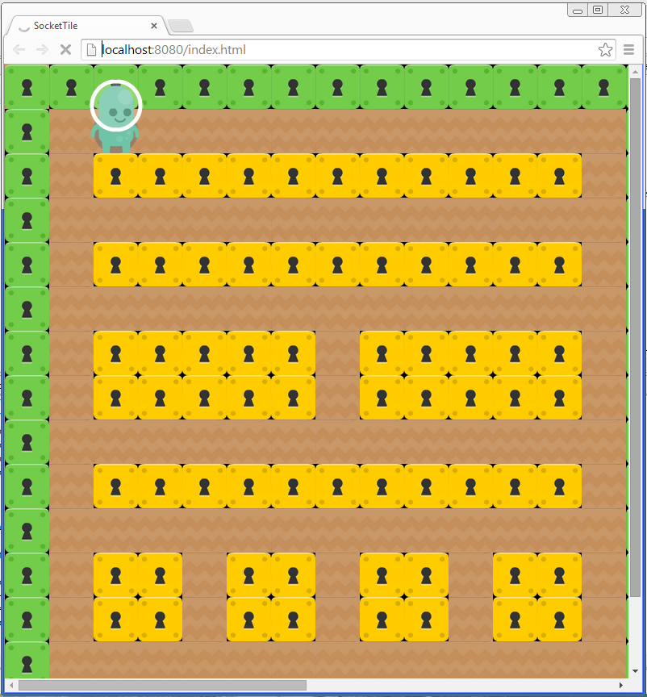
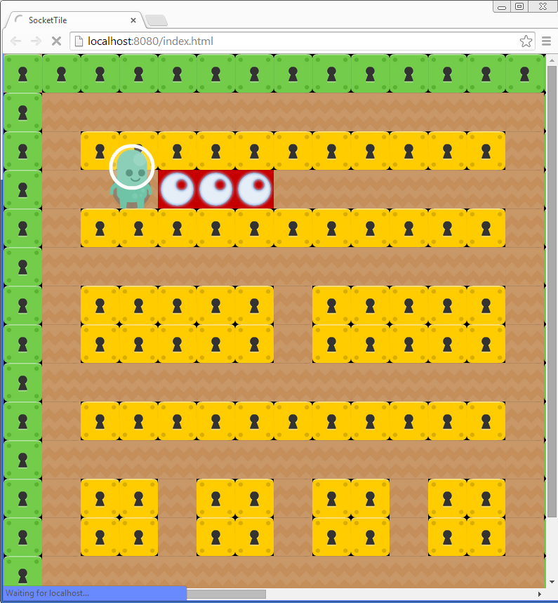
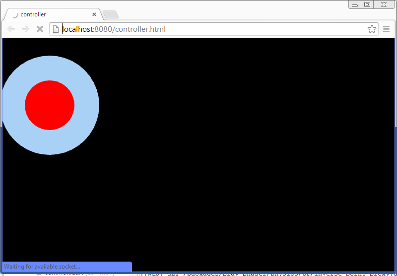

SocketTile
==========

This is an experimental project I am working on using dart and play_phaser, a dart port of phaser(https://github.com/playif/play_phaser). The basic idea is to develop a battle city like multiplayer game, in which player can use their cellphone browser as gamepad to control the heros on computer browser and shoot each other.
Installation
-------
This game is still under development. To run the server, you need to run **serverEntry.dart** under **bin** 
Then you can run a game client by runing **web/index.html**
You will see a little alien figure on the screen, you can move it using arrow keys and make explosion by pressing spacebar. 
Running **web/controller.html** will provide you a game controller. Currently the game controller is not wired up with the actual game.
Screenshots
--------------

Credit
-------
All the assets from http://kenney.nl/
I also use an awesome component-base entity system called Dartemis (https://github.com/denniskaselow/dartemis)
As stated in the beginning, this game uses a dart game engine **play_phaser** (https://github.com/playif/play_phaser)